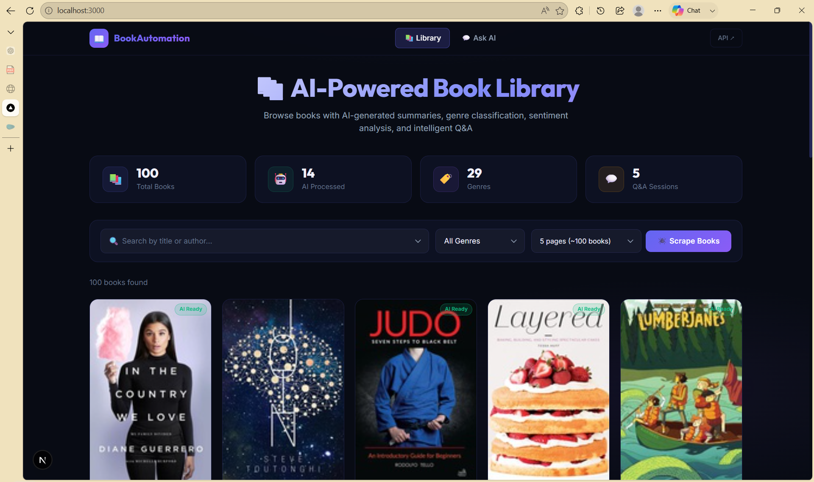
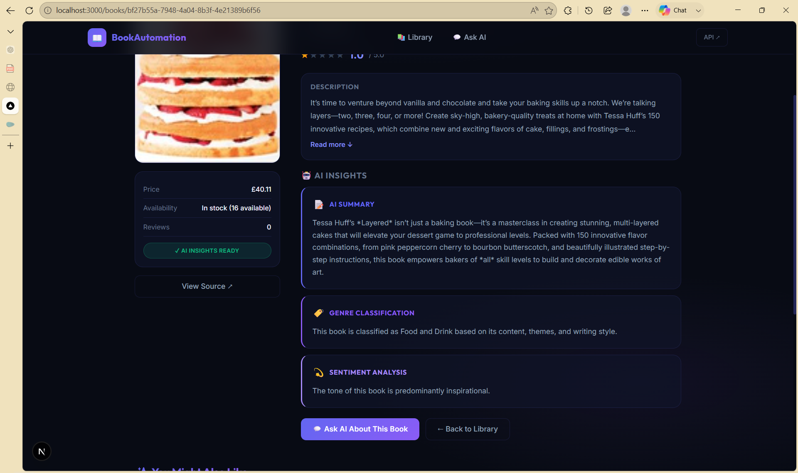
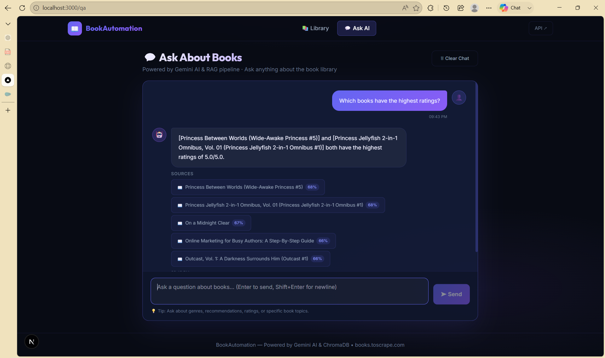

# 📚 BookAutomation — AI-Powered Book Intelligence Platform

A full-stack web application that scrapes books from the web, stores them in a database, and uses AI to generate insights and answer questions via a RAG pipeline.

---

## ✨ Features

| Feature | Description |
|---------|-------------|
| 🕷️ **Book Scraping** | Selenium-powered bulk scraper for books.toscrape.com (up to 1000 books) |
| 🤖 **AI Insights** | Gemini AI generates summaries, genre classification, and sentiment analysis |
| 📖 **RAG Q&A** | Ask questions in natural language; get answers with source citations |
| 🔍 **Semantic Search** | ChromaDB vector store with Gemini embeddings for similarity matching |
| 🎯 **Recommendations** | "If you like X, you'll like Y" recommendation engine |
| ⚡ **Async Processing** | Celery + Upstash Redis for background scraping and AI processing |
| 💾 **Smart Caching** | Redis caching for AI responses (24h) and embeddings (7 days) |
| 🧩 **Smart Chunking** | Semantic chunking with overlapping windows for optimal RAG context |
| 💬 **Chat History** | Persistent Q&A history saved to PostgreSQL |

---





## 🛠️ Tech Stack

| Layer          | Technology                           |
|----------------|---------------------------------------|
| **Backend**    | Django 4.2 + Django REST Framework    |
| **Database**   | Neon PostgreSQL (metadata + history)  |
| **Vector DB**  | ChromaDB (local persistent)           |
| **AI**         | Google Gemini API (`gemma-3-27b-it`)  |
| **Embeddings** | Gemini `models/text-embedding-004`    |
| **Cache**      | Upstash Redis                         |
| **Async**      | Celery + Upstash Redis                |
| **Scraping**   | Selenium + BeautifulSoup              |
| **Frontend**   | Next.js 16 + Tailwind CSS v4          |

---

## 🚀 Setup Instructions

### Prerequisites

- Python 3.11+
- Node.js 18+
- pnpm (or npm)
- Google Chrome (for Selenium)
- Neon PostgreSQL account: https://neon.tech
- Upstash Redis account: https://upstash.com
- Google Gemini API key: https://aistudio.google.com

---

### Backend Setup

```bash
# 1. Navigate to backend
cd backend

# 2. Create and activate virtual environment
python -m venv venv
venv\Scripts\activate         # Windows
# source venv/bin/activate    # macOS/Linux

# 3. Install dependencies
pip install -r requirements.txt

# 4. Configure environment
copy .env.example .env
# Edit .env with your Neon DATABASE_URL, Upstash REDIS_URL, and GEMINI_API_KEY

# 5. Run database migrations
python manage.py migrate

# 6. Create a superuser (optional, for Django admin)
python manage.py createsuperuser

# 7. Start the Django development server
python manage.py runserver
# API is now at http://localhost:8000
```

### Start the Celery Worker (separate terminal)

```bash
cd backend
venv\Scripts\activate
# On Windows:
celery -A config worker --loglevel=info --pool=solo
# On Linux/macOS:
celery -A config worker --loglevel=info
```

---

### Frontend Setup

```bash
# 1. Navigate to frontend
cd frontend

# 2. Create environment file
copy .env.example .env.local

# 3. Install dependencies
pnpm install

# 4. Start the dev server
pnpm dev
# Frontend is now at http://localhost:3000
```

---

## 📡 API Documentation

Base URL: `http://localhost:8000/api`

### Books

| Method | Endpoint | Description |
|--------|----------|-------------|
| `GET`  | `/books/` | List all books (paginated) |
| `GET`  | `/books/?search=mystery` | Search books by title/author |
| `GET`  | `/books/?genre=Fiction` | Filter by genre |
| `GET`  | `/books/?processed=true` | Filter AI-processed books |
| `GET`  | `/books/<uuid>/` | Full book detail with AI insights |
| `GET`  | `/books/<uuid>/recommendations/` | Related book recommendations |
| `POST` | `/books/upload/` | Manually add a book |
| `POST` | `/books/scrape/` | Trigger background Selenium scraper |

#### POST `/books/scrape/`
```json
// Request
{ "max_pages": 5 }

// Response (202 Accepted)
{
  "message": "Scraping 5 page(s) started in the background.",
  "task_id": "abc-123-...",
  "max_pages": 5,
  "estimated_books": 100
}
```

#### POST `/books/upload/`
```json
// Request
{
  "title": "Dune",
  "author": "Frank Herbert",
  "rating": 4.8,
  "description": "A science fiction masterpiece...",
  "book_url": "https://example.com/dune",
  "genre": "Science Fiction"
}
```

### Q&A (RAG)

| Method | Endpoint | Description |
|--------|----------|-------------|
| `POST` | `/qa/`   | Ask a question (RAG pipeline) |
| `GET`  | `/chat/history/` | Retrieve Q&A history |

#### POST `/qa/`
```json
// Request
{
  "question": "What are some good mystery books?",
  "top_k": 5
}

// Response
{
  "question": "What are some good mystery books?",
  "answer": "Based on the collection, I found several excellent mystery books...",
  "sources": [
    {
      "book_id": "uuid-...",
      "book_title": "Sharp Objects",
      "chunk_index": 0,
      "relevance_score": 0.923
    }
  ]
}
```

### Utility

| Method | Endpoint | Description |
|--------|----------|-------------|
| `GET`  | `/genres/` | List all distinct genres |
| `GET`  | `/stats/`  | Database statistics |

---

## 💬 Sample Questions & Answers

### Q1: "What are the best mystery books in the collection?"
> **Answer:** Based on the book database, here are some top-rated mystery books: [Sharp Objects] — rated 4.5/5 with a Dark, Suspenseful tone. [The Girl on the Train] is another highly-rated mystery that readers love...

### Q2: "Recommend a book similar to Harry Potter"
> **Answer:** If you enjoy fantasy adventures like Harry Potter, you might love [Percy Jackson] which shares themes of young heroes discovering magical abilities. [The Name of the Wind] offers a similarly immersive fantasy world...

### Q3: "What are the most uplifting books?"
> **Answer:** For uplifting reads, [The Alchemist] (rated 4.8/5) features an Inspirational tone with themes of following your dreams. [Wonder] is described as Uplifting and particularly popular with readers seeking hope...

### Q4: "Tell me about books with dark themes"
> **Answer:** Several books in the collection feature dark, intense themes. [1984] by George Orwell has a distinctly Dark tone — it's a dystopian tale of surveillance and totalitarianism. [Lord of the Flies] similarly explores the darker sides of human nature...

### Q5: "Which Science Fiction books are available?"
> **Answer:** The library contains several Science Fiction titles: [Dune] by Frank Herbert (rated 4.9/5) is a space opera epic. [The Hitchhiker's Guide to the Galaxy] offers comedic sci-fi. [Ender's Game] focuses on a genius child training to fight alien wars...

---

## 🏗️ Database Schema

### Books Table
| Field | Type | Description |
|-------|------|-------------|
| id | UUID | Primary key |
| title | VARCHAR(500) | Book title |
| author | VARCHAR(300) | Author name |
| rating | FLOAT | Rating out of 5.0 |
| num_reviews | INT | Number of reviews |
| description | TEXT | Book description |
| book_url | URL | Source URL (unique) |
| cover_image | URL | Cover image URL |
| genre | VARCHAR(200) | Genre (AI-classified) |
| sentiment | VARCHAR(100) | Tone (AI-analyzed) |
| summary | TEXT | AI-generated summary |
| recommendations | JSON | AI-suggested similar books |
| price | VARCHAR(50) | Book price |
| availability | VARCHAR(100) | Stock status |
| processed | BOOLEAN | AI processing status |
| created_at | TIMESTAMP | Record creation time |

### Book Chunks Table
| Field | Type | Description |
|-------|------|-------------|
| id | UUID | Primary key |
| book | FK → Book | Parent book |
| chunk_text | TEXT | Text chunk content |
| chunk_index | INT | Chunk order |
| embedding_id | VARCHAR | ChromaDB document ID |

### Chat History Table
| Field | Type | Description |
|-------|------|-------------|
| id | UUID | Primary key |
| question | TEXT | User question |
| answer | TEXT | AI answer |
| sources | JSON | Source citations |
| created_at | TIMESTAMP | Session time |

---

## 📁 Project Structure

```
BookAutomation/
├── backend/
│   ├── config/              # Django project config
│   │   ├── settings.py      # Full app settings (DB, Redis, Celery, AI)
│   │   ├── celery.py        # Celery app
│   │   └── urls.py          # Root URL config
│   ├── bookapp/             # Main Django app
│   │   ├── models.py        # Book, BookChunk, ChatHistory, AICache
│   │   ├── views.py         # REST API views
│   │   ├── serializers.py   # DRF serializers
│   │   ├── urls.py          # API URL routing
│   │   ├── tasks.py         # Celery async tasks
│   │   ├── scraper.py       # Selenium scraper
│   │   ├── chunker.py       # Smart text chunking
│   │   ├── ai_engine.py     # Gemini AI integration
│   │   └── rag.py           # Full RAG pipeline
│   ├── requirements.txt
│   └── .env.example
└── frontend/
    ├── app/
    │   ├── page.tsx          # Dashboard / Book Listing
    │   ├── qa/page.tsx       # Q&A Chat Interface
    │   ├── books/[id]/       # Book Detail Page
    │   │   └── page.tsx
    │   ├── components/       # Reusable UI components
    │   │   ├── Navbar.tsx
    │   │   ├── BookCard.tsx
    │   │   ├── LoadingSkeleton.tsx
    │   │   ├── ChatMessage.tsx
    │   │   ├── RatingStars.tsx
    │   │   └── GenreBadge.tsx
    │   ├── lib/
    │   │   ├── api.ts        # API client
    │   │   └── types.ts      # TypeScript interfaces
    │   ├── globals.css       # Design system
    │   └── layout.tsx        # Root layout
    └── .env.example
```

---

## ⚡ Quick Workflow

1. **Start backend**: `python manage.py runserver`
2. **Start Celery**: `celery -A config worker --pool=solo`
3. **Start frontend**: `pnpm dev`
4. **Scrape books**: Click "🕷️ Scrape Books" on the dashboard (or POST to `/api/books/scrape/`)
5. **Wait for processing**: Celery automatically processes all scraped books with AI
6. **Ask questions**: Click "💬 Ask AI" and start querying the knowledge base

---

## 🔒 Caching Architecture

```
User Request → Redis Cache HIT → Return cached response
                     ↓ MISS
               Gemini API call → Store in Redis (TTL varies)
                     ↓
               Return fresh result

Cache TTLs:
  AI Responses (summaries, genres):  24 hours
  Embeddings:                         7 days
  RAG query answers:                  1 hour
  API list endpoints:                 5 minutes
  Stats:                              2 minutes
```

---

## 📸 Screenshots

> Screenshots will be added after the application is run.
> Launch the app with the setup instructions above, then view:
> - `http://localhost:3000` — Dashboard with book grid
> - `http://localhost:3000/qa` — Q&A Chat interface  
> - `http://localhost:3000/books/<id>` — Book detail with AI insights

---

## 🧪 Testing

```bash
# Test backend API
curl http://localhost:8000/api/stats/
curl http://localhost:8000/api/books/
curl -X POST http://localhost:8000/api/books/scrape/ \
  -H "Content-Type: application/json" \
  -d '{"max_pages": 2}'

# Test Q&A
curl -X POST http://localhost:8000/api/qa/ \
  -H "Content-Type: application/json" \
  -d '{"question": "What mystery books do you have?"}'
```

---

## 📄 License

MIT
